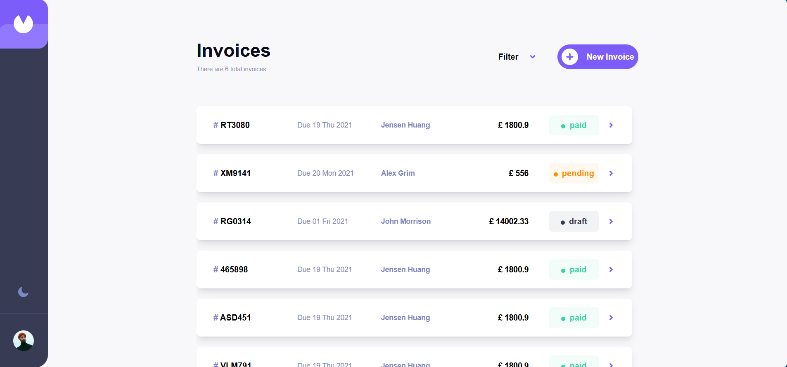

# Invoice App Website

## Description

This project is an intuitive and user-friendly invoice app designed to help freelancers and small businesses create and manage invoices with ease. Currently under development, the app aims to provide a seamless invoicing experience with a variety of features to cater to different user needs.For now, you can clone the repository and run the app on your local machine by following the setup instructions below. After updating `db.json` file according to your information, you can add, delete, and update invoices as needed.

## Features

-   Create and manage invoices effortlessly with a user-friendly interface.
-   User authentication system for secure access and management of invoices.
-   Download and print invoices directly from the app.
-   Responsive design for optimal viewing across devices.

## Technologies

-   React
-   TypeScript
-   Tailwind CSS
-   Redux
-   Ant Design
-   React Tostify

## Setup

1. Clone this repository to your local machine.
2. Run `npm install` to install the necessary dependencies.
3. Run `npm run concurrently` to start the development server.

## Demo

A live demo will be available soon. Stay tuned!
